<?xml version="1.0" encoding="utf-8"?>
<!DOCTYPE html PUBLIC "-//W3C//DTD XHTML 1.0 Strict//EN" "http://www.w3.org/TR/xhtml1/DTD/xhtml1-strict.dtd">
<html xml:lang="en" lang="en" xmlns="http://www.w3.org/1999/xhtml">
  <head>
    <meta http-equiv="Content-Style-Type" content="text/css" />
    <title>h2zTIsbK</title>
    <link rel="stylesheet" type="text/css" href="./h2zTIsbK/h2zTIsbK.css" />
    <!--[if IE]><![endif]-->
    
  </head>
  <body>
    

      

        <table style="border:0;width:100%;">
          <tbody>
            <tr>
              <td bgcolor="eeeeee" align="right">
                
                  <b>Page 1</b>
                
              </td>
            </tr>
          </tbody>
        </table>
      

      

        

Desarrollar una aplicación web usando una de las API gratuitas de API List Fun. Tener en 

cuenta que se deben aplicar buenas prácticas para el desarrollo de la interfaz gráfica de 

usuario, para la cual se permite utilizar plantilla de Bootstrap. 

 

Página Web 

Es una página tipo blog dedicada a la comida, tiene una barra de búsqueda en el lado derecho 

de la pantalla y en el centro se mostrarán los resultados en una tabla de manera ordenada. 
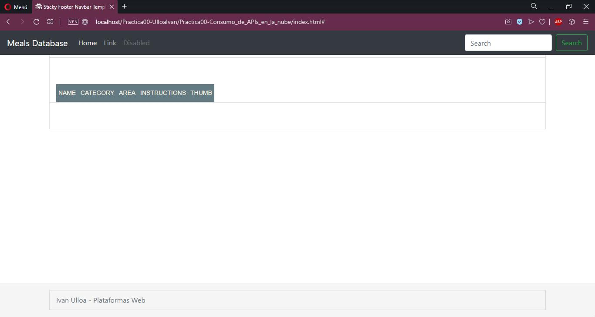
 

 

Funcionalidad Básica 

La pagina web se centra en visualizar la información tomada de una API dedicada a comida 

(TheMealDB). 

API: https://www.themealdb.com/api.php?ref=apilist.fun  

 

La  información  es  solicitada  por  medio de  una  función  GET  utilizando  AJAX.  El  token 

utilizado es el número 1, autorizado por la página para el uso educativo: 
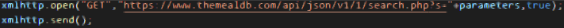
 

 

Luego la información obtenida como texto se transforma a formato JSON, para ser leída y 

distribuida en la tabla por medio de la función buildTable(): 

      

      

        

        <table style="border:0;width:100%;">
          <tbody>
            <tr>
              <td bgcolor="eeeeee" align="right">
                
                  <b>Page 2</b>
                
              </td>
            </tr>
          </tbody>
        </table>
      

      

        

          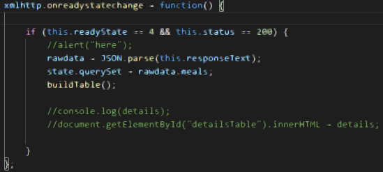
 

 

Con un bucle for se recorre por el archivo JSON obteniendo los datos para llenar la tabla en 

el archivo HTML: 
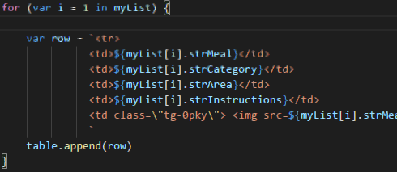
  

 

La información se presenta en la página de la siguiente manera: 
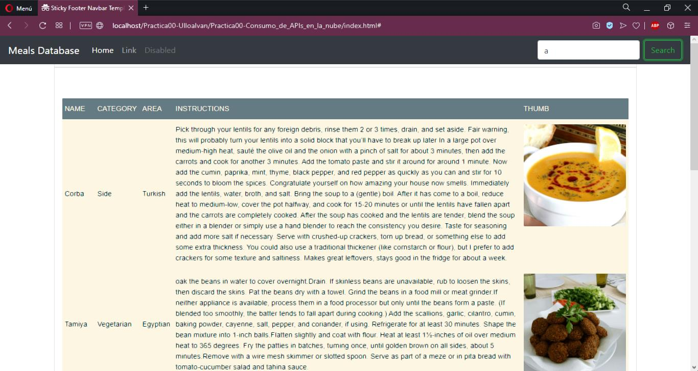
 

 

      

      

        

        <table style="border:0;width:100%;">
          <tbody>
            <tr>
              <td bgcolor="eeeeee" align="right">
                
                  <b>Page 3</b>
                
              </td>
            </tr>
          </tbody>
        </table>
      

      

        

Paginación 

La información que es mostrada en la tabla está distribuida en páginas de 5 objetos cada una. 

Para lograr esto se utilizan un conjunto de funciones que separarán la información en las 

distintas páginas, ubicarán la información en la tabla y posicionarán los botones en la parte 

inferior  de  la  página.  La  primera  función  a  la  que  se  ingresa  después  de  obtener  la 

información es buildTable(), esta función llama a los otros métodos relacionados y después 

ubica los datos en la tabla. 
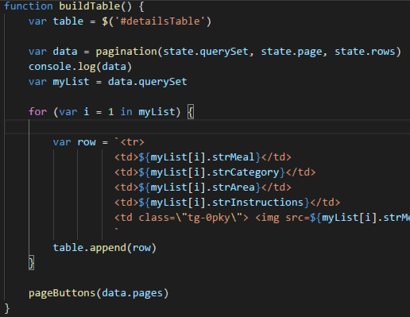
 

 

Se declaran algunas variables relacionadas al estado de la búsqueda (state), estas variables 

son: número de objetos por página, los datos en formato JSON y la primera página. 
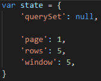
 

 

La siguiente función es pagination() que se encarga de dividir los datos JSON en partes (5 

en este caso). La función slice propia de Javascript nos ayuda con ese trabajo, al final teniendo 

como resultado el JSON por partes y el número de páginas que tendrá la tabla. 

      

      

        

        <table style="border:0;width:100%;">
          <tbody>
            <tr>
              <td bgcolor="eeeeee" align="right">
                
                  <b>Page 4</b>
                
              </td>
            </tr>
          </tbody>
        </table>
      

      

        

          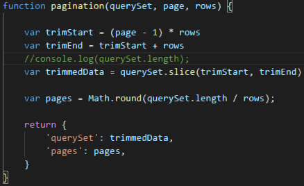
 

La última función es la más extensa, dedicada a colocar los botones con las distintas páginas 

resultada de la función anterior; la función es llamada pageButtons(). La función recibe un 

parámetro, las páginas, con la ayuda de las variables antes mencionadas podemos calcular la 

ubicación de cada botón en el HTML. 
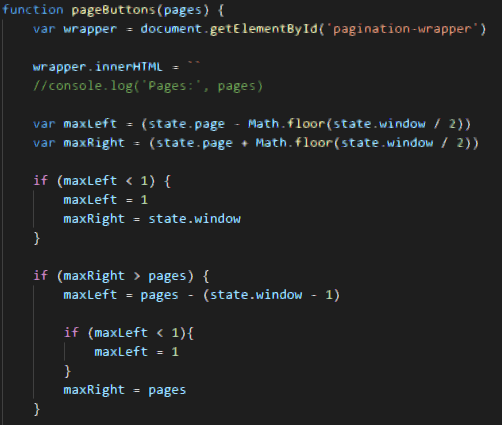
 

 

Después de calcular la distancia del botón se procede a colocar el botón en la página, la 

primera vez se colocan dos botones adicionales, última página (Last) y primera página (First). 

Cada botón es creado después de que la tabla en esa página esté llena. 

      

      

        

        <table style="border:0;width:100%;">
          <tbody>
            <tr>
              <td bgcolor="eeeeee" align="right">
                
                  <b>Page 5</b>
                
              </td>
            </tr>
          </tbody>
        </table>
      

      

        

 

Al final la paginación se ve de esta manera en el blog: 

 

REFERENCIAS 

TheMealDB: https://www.themealdb.com/api.php?ref=apilist.fun  

Paginación: https://jsfiddle.net/ivanov11/e18zfsau/  

 
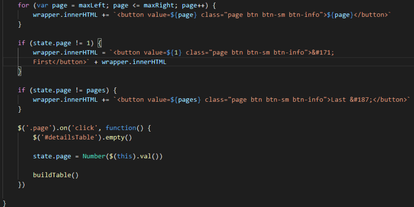
 
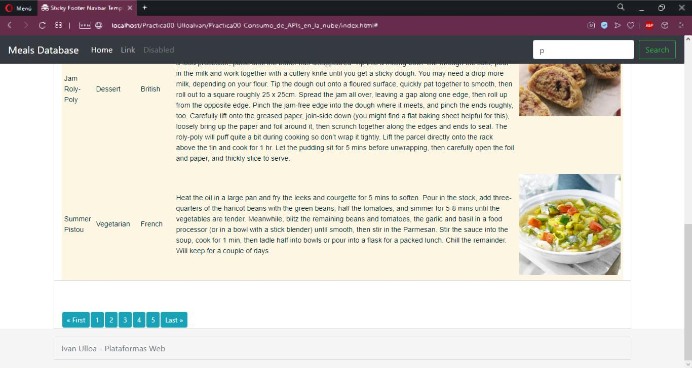
 

      

    

  </body>
</html>